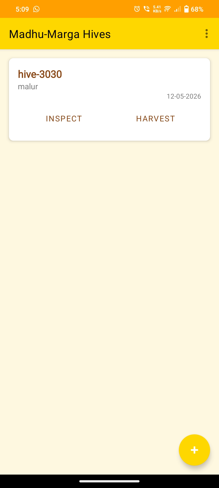
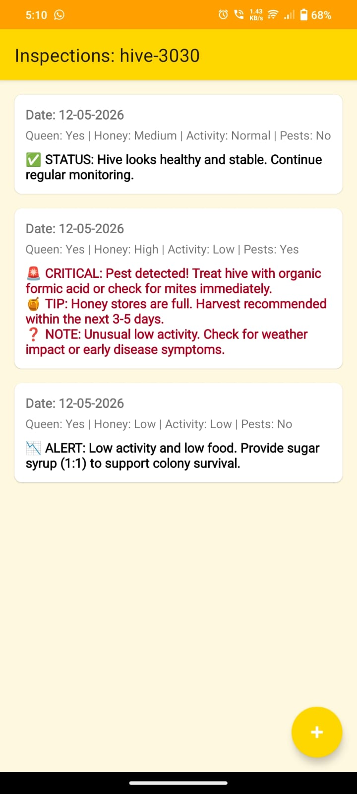
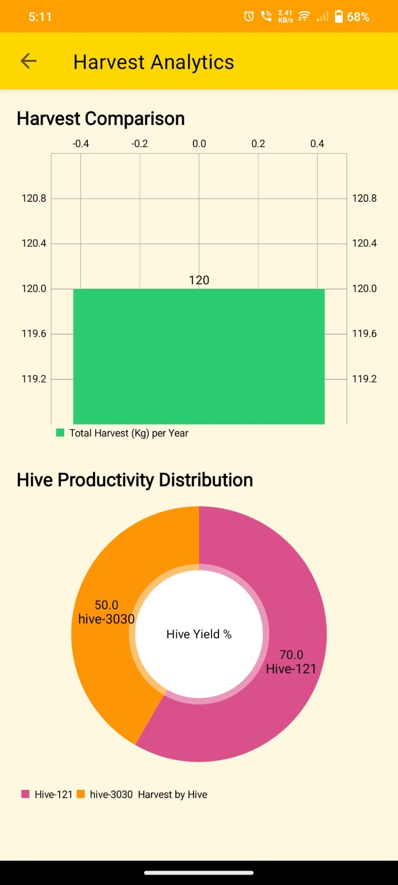

# 🐝 Madhu-Marga: AI-Guided Beekeeping Assistant

Madhu-Marga (meaning "The Path of Honey") is a professional-grade Android application designed as a **Digital Beekeeper’s Diary**. It serves as an intelligent assistant for farmers to manage bee hives, monitor colony health, and maximize honey production through data-driven insights.

---

## 🚀 Key Features

### 📋 Hive Management & Digital Logging
Replace messy paper notebooks with a digital inventory. Register hives with unique IDs and track their geographic locations.

### 🧠 Simulated AI Decision Matrix
The heart of the app is a rule-based logic engine that analyzes your observations.
- **Critical Alerts:** Detects pests and queen issues.
- **Actionable Tips:** Recommends when to split a colony or prepare for harvest based on activity and honey flow.
- **Color-Coded Severity:** Instant visual feedback (Red for Critical, Orange for Warning, Green for Advice).

### 📊 Harvest Analytics
Log your honey yield and visualize it instantly.
- **Yearly Comparison:** Bar charts to compare production trends over time.
- **Productivity Distribution:** Pie charts to identify your "Star Performer" hives.

### 🗓️ Flora Calendar
A built-in botanical guide that helps beekeepers plan their year based on local flowering seasons for various nectar sources.

---

## 📸 Screenshots

|               Home Dashboard                |            AI Inspection Alerts             |              Harvest Analytics              |
|:-------------------------------------------:|:-------------------------------------------:|:-------------------------------------------:|
|  |  |  |

---

## 🛠️ Tech Stack 
- **Language:** Java & Kotlin DSL
- **UI Framework:** XML with Google Material Design
- **Database:** Room (SQLite) for offline-first persistence
- **Charts:** MPAndroidChart
- **DevOps:** GitHub Actions (CI/CD) for automated APK builds

---

## ⚙️ Installation & Usage
1. **Download the APK:** Go to the [Releases](https://github.com/Deepak-gowda11/Deepak-Mind_Matrix_Internship-Project-1CD22IS046/releases) section and download `app-debug.apk`.
2. **Install:** Enable "Install from Unknown Sources" on your Android device.
3. **Log In:** No cloud login required—all data is stored locally and securely on your device.

---

## 📝 Problem Statement
Traditional beekeeping relies on manual memory, leading to missed signs of colony failure. **Madhu-Marga** solves this by providing a structured management system that transforms raw observations into actionable intelligence, reducing colony loss and increasing profitability for rural farmers.

---

## 👨‍💻 Developer
Developed as part of the **Mindmatrix Internship Program**.  
**Author:** Deepak Gowda  
**Status:** Version 1.0 (Stable)
